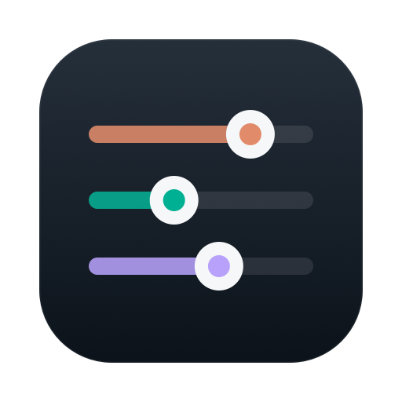

# Agent Cockpit

<p align="center">
  
</p>

macOS desktop control panel for AI coding agent configuration. See and edit every **MCP server, skill, subagent, slash command, plugin, settings file and instruction doc** across **Claude Code, OpenAI Codex and Cursor** — in one window, with diff previews and automatic backups before every write.

## Why

Agent configuration is scattered across many files in different formats:

| Surface | Claude Code | Codex | Cursor |
|---|---|---|---|
| MCP servers (user) | `~/.claude.json` | `~/.codex/config.toml` | `~/.cursor/mcp.json` |
| MCP servers (project) | `~/.claude.json` + `.mcp.json` | — | `.cursor/mcp.json` |
| Skills | `~/.claude/skills/` | `~/.codex/skills/` | `~/.cursor/skills/` |
| Subagents | `~/.claude/agents/` | — | `~/.cursor/agents/` |
| Slash commands | `~/.claude/commands/` | — | — |
| Plugins | `settings.json` + `installed_plugins.json` | `config.toml` | — |
| Instructions | `CLAUDE.md` / `AGENTS.md` | `AGENTS.md` / rules | — |

Agent Cockpit reads all of them into one inventory and writes them back **surgically**.

## Safety model

Editing these files by hand (or with a naive tool) is risky — `~/.claude.json` holds ~70 unrelated state keys, and `config.toml` has comments you don't want to lose. Every write in Agent Cockpit goes through the same pipeline:

1. **Surgical edits only** — JSON is edited via `jsonc-parser` text edits (only the target subtree's bytes change; never a whole-file re-serialize). TOML is spliced via AST ranges (`toml-eslint-parser`), so comments and formatting outside the touched block survive byte-for-byte.
2. **Diff preview** — every save shows the exact file diff first. Env var / header values are masked in diffs.
3. **Conflict detection** — the file's hash is checked at apply time; if Claude Code or your editor changed it since preview, you get a conflict banner instead of a silent overwrite.
4. **Automatic backups** — the original file is snapshotted (last 50 per file) before each write; restore from the Backups tab, also with diff preview.
5. **Atomic writes** — temp file + rename in the same directory, preserving file mode (`config.toml` stays `0600`).

`~/.codex/auth.json`, `.env*` and anything credential-shaped is hard-denied at the IPC layer — the renderer can never read it.

Note: if an agent process rewrites its own config at the exact moment you apply, last writer wins — the conflict check closes the preview→apply window, not concurrent writes after apply.

## Install

Download the `.dmg` from Releases, or build locally:

```bash
npm ci
npm run package   # → release/Agent Cockpit-<version>-arm64.dmg
```

The app is not notarized (no Apple Developer ID). On first launch: right-click the app → **Open** → Open, or remove the quarantine flag:

```bash
xattr -dr com.apple.quarantine "/Applications/Agent Cockpit.app"
```

## Development

```bash
npm ci
npm run dev        # electron-vite dev server with HMR
npm run typecheck
npm run coverage   # vitest — src/lib is gated at 100% statements/branches/functions/lines
npm run build
```

Architecture: everything that decides *what* to write lives in `src/lib` as pure functions (`FileSnapshot → FileEdit`), which is what makes the 100% coverage gate possible. `src/main` is a thin fs/IPC adapter (path allowlist, backups, atomic writes, chokidar watcher), `src/renderer` is React. The renderer only talks through one typed `contextBridge` API — `contextIsolation` on, `sandbox` on, no remote content, strict CSP.

## License

MIT
